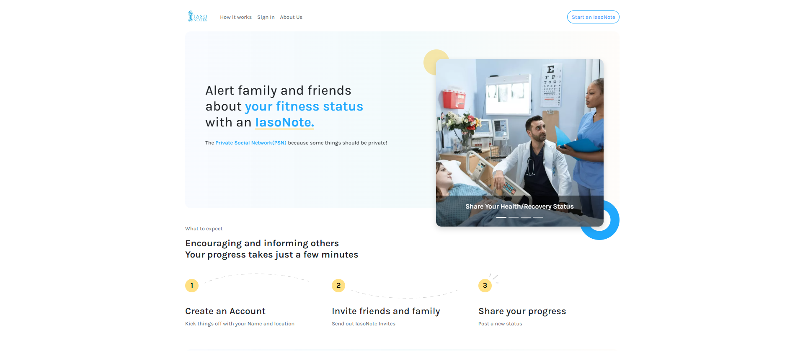

 

<h4>
Personal Projects
</h4>

      

        

          
          

            <h5 class="card-title">Iasonotes </h5> 
            
A full-stack web application used as a status website targeted at hospital patients where users can make posts that notify subscribers. 

             
          

        

      

      

        

          
          

            <h5 class="card-title">FakeStackOverflow</h5>
            
A web application built to replicate Stack Overflow. 

          

        

      

      

        

          
          

            <h5 class="card-title">Tweeter</h5>
            
A web application built to visualize specific data from tweets all around the world after inputting a search term.

          

        

    

